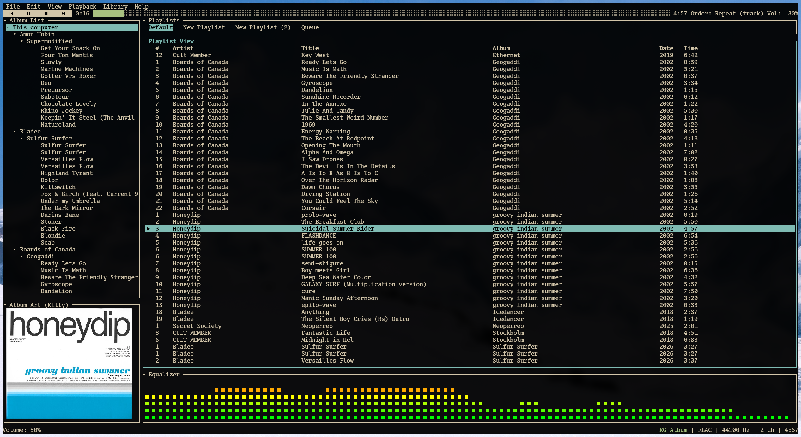

# Staccato

One terminal music player to rule them all, one TUI to find them, one player to bring them all and play them in the terminal.



## Features

- Stupidly lightweight
- foobar2000-esque design
- ReplayGain
- Soulseek integration
- Network library streaming over QUIC
- Album covers via Sixel or Kitty's image protocol
- Drag-and-drop via OSC 72 (Kitty only for now)
- And a bunch of other cool stuff

## Usage

Run the binary from your terminal, or double-click the executable on Windows to open it in a terminal automatically.

To share a music library over the network:

```bash
staccato serve ~/Music
```

Connect from the TUI via **Library → Connect to server**, or from the command line:

```bash
staccato connect <HOST_IP>:1744 --code <PAIRING_CODE>
```

## Building

```bash
cargo build
```

For a release build:

```bash
cargo build --release
```

## License

Staccato is licensed under the [MIT License](LICENSE).
